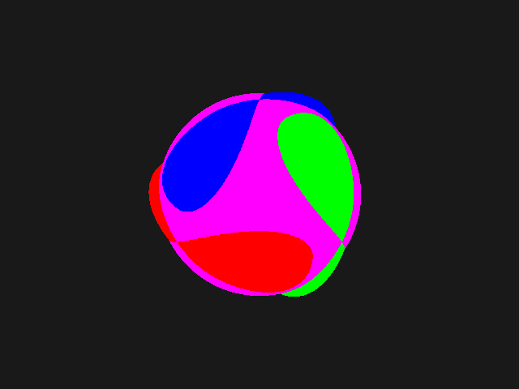
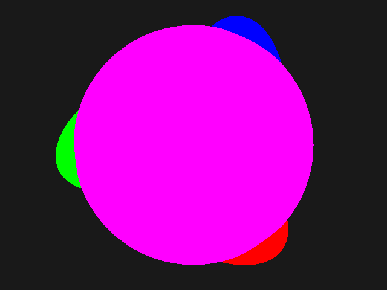
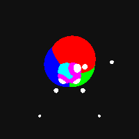

# CSci 5607

## Assignment 1
This assignment was programmed in C and compiled on Windows using `gcc` via MinGW64. The standard `-std=gnu99` is now enforced by the `Makefile`. It is verified that this code compiles on the CSELabs computers.

## Files
The `turnin.tar` for this assignment should contain:

* Auto-generation tools
```
Makefile
Doxyfile
```
* Documentation
```
README.md
```
* Test scenes and images
```
data/many.scene
data/many.png
```
* Source code
```
src/driver/main.c
src/image.c
src/image.h
src/macro.h
src/parser.c
src/parser.h
src/ppm.c
src/ppm.h
src/raytrace.c
src/raytrace.h
src/scene.c
src/scene.h
src/shape.c
src/shape.h
src/tracemalloc.c
src/tracemalloc.h
src/vector.c
src/vector.h
```

## Building
There are no dependencies on external libraries. For compatibility, `libm.a` is explicitly linked to, but should be part of the C standard library. This project is expected to be compiled with `gcc` with `-std=gnu99` using the given `Makefile`. To build the project, run `make all`. This will create `main.exe` which is the program to run.

## Scene files
Input files may be located anywhere and may have any file extension
* Comments are lines that begin with `#`. These are ignored.
* Empty lines are ignored, as are lines containing only whitespace.
* Lines without the required number of arguments or with too many arguments are errors. Each instruction must begin and end on the same line.
* Each of the required fields must be present, but may be in any order. Each may only appear once. A file may contain 0 or more shape definitions.
* All material fields must be defined before any shapes, but may be redefined arbitrarily later.

In this format, `<vector>` refers to a list of 3 decimals separated by whitespace, which respectively represent the x, y, and z coordinates of a vector. `<color>` refers to a list of 3 decimals, each of which are between `0.0` and `1.0`, which respectively represent the red, green, and blue components of the color. `<decimal>` and `<integer>` may be any numbers.

### Required fields
* ```eye <vector>```: The position of the viewing eye. This changes the absolute position of the viewer within the scene.
* ```viedir <vector>```: The direction the viewer is looking. Shapes behind the viewer are not rendered. Must be nonzero.
* ```updir <vector>```: The rotation around the view direction. This changes the apparent "upwards" direction in the image by rotating the scene. Must be nonzero and noncolinear to the `viewdir`.
* ```fovv <decimal>```: The vertical field of view in degrees. Decreased field of view correlates with zooming in from the eye.
* ```imsize <integer> <integer>```: The dimensions of the image. Must be positive integers. Decimals will be rounded down. The proportion of the shapes in the image will not change but increased resolution is acquired at higher sizes.
* ```bkgcolor <color>```: The background color.

### Material properties
* ```mtlcolor <color>```: The color of all subsequent shapes. May be redefined arbitrarily. Must be defined before any shapes.

### Shape definitions
* ```sphere <vector> <decimal>```: A sphere with the given center and radius. Nonpositive radius will cause the sphere to become invisible.
* ```ellipsoid <vector> <vector>```: An ellipsoid with the given center and dimension vector. Nonpositive dimensions will cause errors.

## Executing
To execute the program, run `./main.exe input.scene` where `input.scene` is a valid text file in the format described above, located anywhere on the file system. This will generate a file with the same base name as the input file and the suffix `.ppm` which shall be a P3-encoded ASCII PPM image containing the rendered scene.

Render time will increase as the image size and number of objects increase.

`main.exe` is not compiled in debug mode. To enable debug mode, add `-DDEBUG` and remove `-DNDEBUG` from the `CFLAGS` variable in the `Makefile`. To enable memory allocation tracing, define `-DTRACE` in the same manner.

Any errors will be reported on the terminal, and an output image will not be generated.

## Example


The above images are different views of the same scene. The lower scene is being viewed from the opposite direction at the same distance. The up direction has also rotated 90 degrees, and the field of view has decreased, leading to a zooming effect.


The included `data/many.png` is generated from `data/many.scene`.

## Documentation
The code is documented using Doxygen-compatible commenting. To create the documentation webpage, run `make doc` and launch `doc/html/index.html` in a web browser. You must have `doxygen` installed.

Doxygen-style documentation is found in header files and the main file. The implementation files also contain comments, but not Doxygen comments.

## Cleanup
To delete build files, run `make clean`. To delete all generated files, run `make spotless`.
