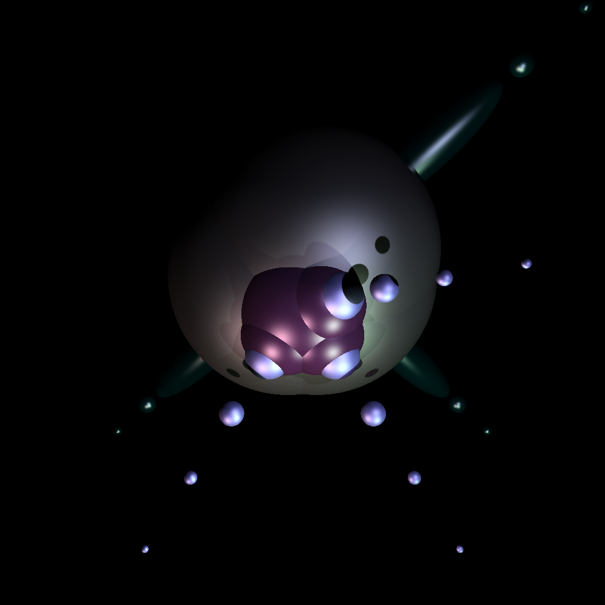
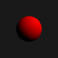
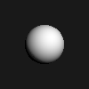
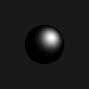
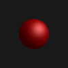

# CSci 5607
Here is the example image for this submission:
 

## Writeup
The ambient component of the material color increases the lightness of areas of a shape that are not directly illuminated. `0` makes these areas invisible, while `1` makes these areas the same color as the whole shape. The diffuse component increases the intensity of illuminated areas on the shape - `0` removes this entirely and `1` is the maximal intensity. The specular component similarly changes the intensity of reflected light from the shape, using the shape's highlight color instead of normal color. The specular exponent changes how sharp the area is: `0` is dull and increasing numbers cause the highlight to become smaller.

 
These are images of the same sphere with the parameters changed. The sphere is pure red with a  pure white highlight color. The first three images are entirely lit by ambient, diffuse, and specular light respectively. The fourth image deomstrates a higher specular exponent. The final image has combined all three forms of light.

## Building
This assignment was programmed in C and compiled on Windows using `gcc` via MinGW64. The standard `-std=gnu99` is now enforced by the `Makefile`. It is verified that this code compiles on the CSELabs computers.

There are no dependencies on external libraries. For compatibility, `libm.a` is explicitly linked to, but should be part of the C standard library. This project is expected to be compiled with `gcc` with `-std=gnu99` using the given `Makefile`. To build the project, run `make all`. This will create `main.exe` which is the program to run.

## Scene files
Input files may be located anywhere and may have any file extension
* Comments are lines that begin with `#`. These are ignored.
* Empty lines are ignored, as are lines containing only whitespace.
* Lines without the required number of arguments or with too many arguments are errors. Each instruction must begin and end on the same line.
* Each of the required fields must be present, but may be in any order. Each may only appear once. A file may contain 0 or more shape definitions.
* All material fields must be defined before any shapes, but may be redefined arbitrarily later.

In this format, `<vector>` refers to a list of 3 decimals separated by whitespace, which respectively represent the x, y, and z coordinates of a vector. `<color>` refers to a list of 3 decimals, each of which are between `0.0` and `1.0`, which respectively represent the red, green, and blue components of the color. `<decimal>` and `<integer>` may be any numbers.

#### Required fields
* `eye <vector>`: The position of the viewing eye. This changes the absolute position of the viewer within the scene.
* `viedir <vector>`: The direction the viewer is looking. Shapes behind the viewer are not rendered. Must be nonzero.
* `updir <vector>`: The rotation around the view direction. This changes the apparent "upwards" direction in the image by rotating the scene. Must be nonzero and noncolinear to the `viewdir`.
* `fovv <decimal>`: The vertical field of view in degrees. Decreased field of view correlates with zooming in from the eye.
* `imsize <integer> <integer>`: The dimensions of the image. Must be positive integers. Decimals will be rounded down. The proportion of the shapes in the image will not change but increased resolution is acquired at higher sizes.
* `bkgcolor <color>`: The background color.

#### Material properties
* `mtlcolor <color> <color> ka kd ks n`: The color of all subsequent shapes. May be redefined arbitrarily, but must be defined before any shapes. The first color is the diffuse color and the second is the specular highlight color. The `ka`, `kd`, and `ks` are respectively the ambient, diffuse, and specular reflectivity of the objects. `n` is the specular exponent.

#### Light definitions
* `light <vector> type <color>`: If the `type` is `0`, this creates a directed light in the direction of the vector. If the `type` is `1` this creates a point light by interpreting the vector as a point. The light has the given color.
* `spotlight <vector> <vector> <decimal> <color>`: This creates a spotlight. The two vectors are respectively the position and direction. The decimal is the angle of the light. The light shines the given color.

#### Shape definitions
* `sphere <vector> <decimal>`: A sphere with the given center and radius. Nonpositive radius will cause the sphere to become invisible.
* `ellipsoid <vector> <vector>`: An ellipsoid with the given center and dimension vector. Nonpositive dimensions will cause errors.

## Executing
To execute the program, run `./main.exe input.scene` where `input.scene` is a valid text file in the format described above, located anywhere on the file system. This will generate a file with the same base name as the input file and the suffix `.ppm` which shall be a P3-encoded ASCII PPM image containing the rendered scene. Render time will increase as the image size and number of objects increase.

`main.exe` is not compiled in debug mode for speed. To enable debug mode, open the `Makefile` and enable the debug flags as described in comments. It is recommended to pipe `stderr` to a log file because lots of data are generated; such as `./main.exe input.scene 2> error.log`.

In general, any fatal errors will be reported on the terminal and an output image will not be generated.

## Documentation
The code is documented using Doxygen-compatible commenting. To create the documentation webpage, run `make doc` and launch `doc/html/index.html` in a web browser. You must have `doxygen` installed.

Doxygen-style documentation is found in header files and the main file. The implementation files also contain comments, but not Doxygen comments.

## Cleanup
To delete build files, run `make clean`. To delete all generated files, run `make spotless`.
